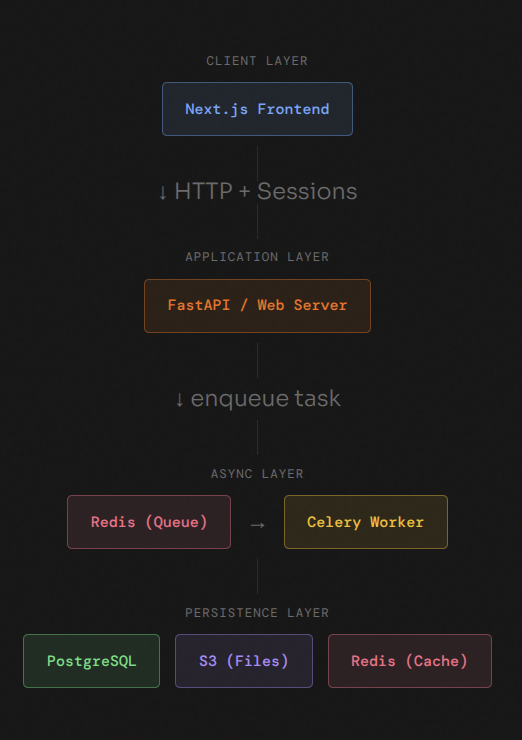

# 🔥 ResumeRoast

> **AI-powered resume feedback that doesn't sugarcoat it.**

ResumeRoast is a full-stack application that analyzes resumes and generates structured feedback using a Large Language Model (LLM).  
It is designed to demonstrate production-style backend patterns around **async processing**, **secure file handling**, **rate limiting**, and **LLM guardrails**.

## 🌐 Live Demo

> Get your resume roasted here - [resumeroast.ddns.net](https://resumeroast.ddns.net)

## ✨ What It Does

- 📄 Accepts resume uploads (PDF)
- 🔍 Extracts and processes resume text
- 🤖 Sends sanitized content to an LLM
- 📋 Returns structured feedback in markdown format
- 🛡️ Enforces per-user daily rate limits


## 🛠️ Tech Stack

| Layer      | Technology             |
|------------|------------------------|
| Frontend   | Next.js + Tailwind CSS |
| Backend    | FastAPI                |
| LLM        | Groq                   |
| Storage    | AWS S3, PostgreSQL, Redis |
| Deployment | VPS                    |


## ☁️ Architecture 

**Current** - self-hosted on a VPS with Docker Compose.



**Future** - planned migration to a fully managed AWS infrastructure.


## ⚙️ How It Works

### 1. File Storage (S3)

- Resumes are uploaded to the backend and stored in **AWS S3**
- Raw files are never exposed directly to the client
- Workers fetch files from S3 for processing

### 2. Async Processing

- On upload, a **roast job** is created and queued
- A **Celery worker** processes the job asynchronously
- The API remains non-blocking throughout
- The frontend **polls** for job completion

### 3. PII Handling

Before sending resume content to the LLM:

- Raw text is extracted from the PDF
- Basic **PII-aware preprocessing** is applied
- Only necessary textual content is forwarded to the model
- No raw files are ever sent, only extracted text

### 4. LLM Integration

- A **structured prompt** is constructed per request
- **Prompt-injection safeguards** are applied before dispatch
- Sanitized text is sent to the Groq LLM API
- The response is stored in the database and returned to the user


## 📋 Prerequisites

- [Docker](https://www.docker.com/get-started) & Docker Compose
- [AWS Account](https://aws.amazon.com/)
- [Groq API Key](https://console.groq.com/)

## 🚀 Running Locally

### 1. Clone the repository

```bash
git clone https://github.com/subhani-syed/ResumeRoast.git
cd ResumeRoast
```

### 2. Configure environment variables

Copy `.env.example` and fill in your credentials:

```bash
cp .env.example .env
```

```env
AWS_REGION=
AWS_ACCESS_KEY_ID=
AWS_SECRET_ACCESS_KEY=
S3_BUCKET_NAME=

DATABASE_URL=
REDIS_URL=

CELERY_BROKER_URL=
CELERY_RESULT_BACKEND=

GROQ_API_KEY=
```

### 3. Start all services

```bash
docker compose up --build
```

This starts the following services:

| Service         | Description               |
|-----------------|---------------------------|
| `server`        | REST API backend          |
| `celery`        | Async job processor       |
| `redis`         | Job queue / result store  |
| `db`            | Primary database          |
| `ui`            | Frontend UI               |


## 📝 Deep Dives

The following posts go into detail on specific design decisions made in this project:

- [Engineering ResumeRoast: Designing a Scalable Application](https://subhani-syed.hashnode.dev/engineering-resumeroast-designing-a-scalable-application)
- [Engineering ResumeRoast: Security by Design](https://subhani-syed.hashnode.dev/engineering-resumeroast-security-by-design)